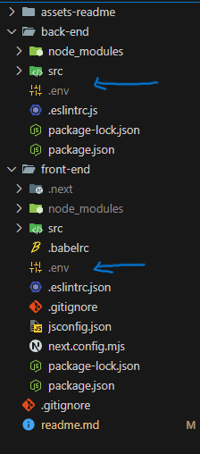
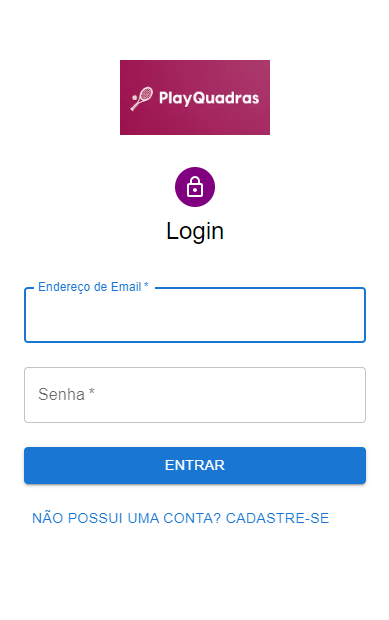
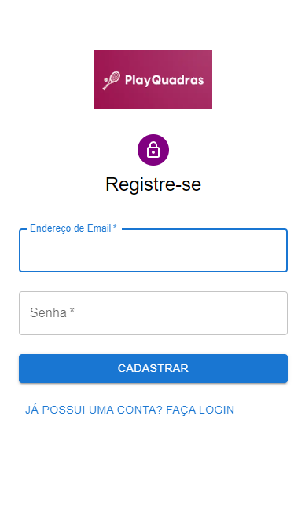
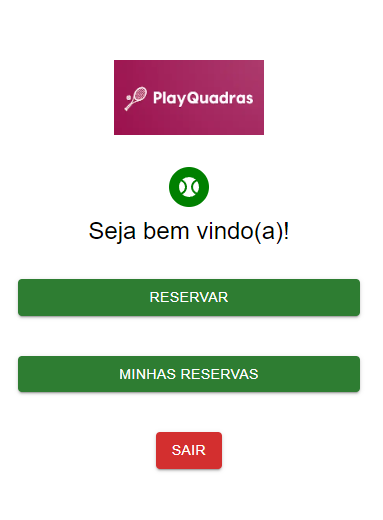
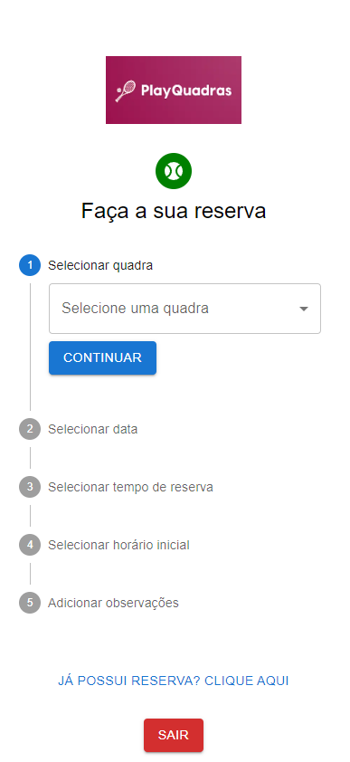
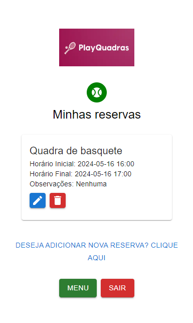
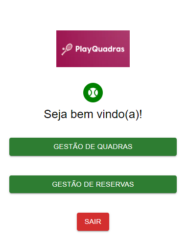
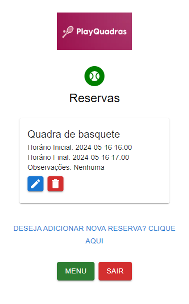
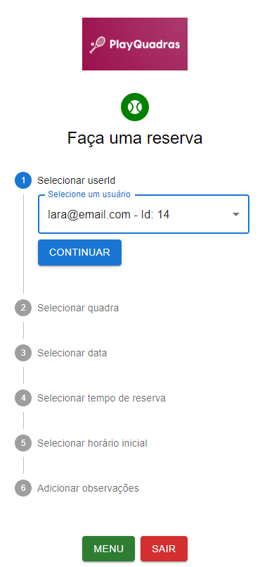
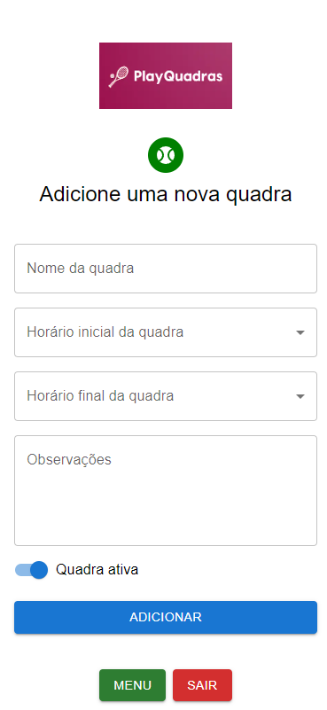

# Tech Challenge 4: Sistema de Agendamento de Quadras Esportivas - PlayQuadras

Este projeto foi desenvolvido para solucionar o desafio do agendamento de espaços compartilhados, com foco específico em quadras esportivas. O sistema oferece aos membros da comunidade a capacidade de visualizar a disponibilidade das quadras, realizar reservas para horários específicos e gerenciar suas reservas de forma eficiente. Além disso, na perspectiva da empresa, o sistema permite que usuários cadastrados como 'administradores' possam cadastrar, atualizar e excluir novas quadras e reservas, garantindo uma gestão eficaz das instalações esportivas.

## Componentes Principais:

1. **Back-end em Node.js**: O back-end foi desenvolvido em Node.js, utilizando o framework Express para criar uma API RESTful que gerencia as operações de reserva, como adicionar, visualizar e cancelar reservas.

2. **Front-end em React com Next.js**: O front-end foi construído em React, uma biblioteca JavaScript para a criação de interfaces de usuário, e o Next.js foi utilizado para facilitar o desenvolvimento, oferecendo renderização do lado do servidor, pré-renderização estática e outras funcionalidades para uma experiência de usuário otimizada.

3. **Banco de Dados PostgreSQL**: O PostgreSQL foi escolhido como banco de dados relacional para armazenar informações sobre os espaços disponíveis, horários de reserva e detalhes das reservas.

4. **ORM Sequelize**: O Sequelize é um ORM (Object-Relational Mapping) para Node.js, utilizado para facilitar a comunicação entre o back-end e o banco de dados PostgreSQL, simplificando a manipulação dos dados.

5. **Material-UI (MUI)**: O Material-UI é uma biblioteca de componentes React que implementa o Material Design, fornecendo componentes pré-projetados para facilitar o desenvolvimento da interface do usuário com um design atraente e responsivo.

5. **Swagger para Documentação de API**: O Swagger foi utilizado para documentar as APIs criadas no projeto. O Swagger oferece uma maneira padronizada de definir a estrutura, os endpoints e os parâmetros das APIs, permitindo gerar automaticamente documentação detalhada a partir do código-fonte

## Funcionalidades-Chave:

1. **Reserva de Horários Específicos**: Os usuários podem reservar horários específicos em uma quadra escolhida, indicando a data e o horário desejados.

2. **Visualização de Horários Disponíveis**: Os usuários têm a opção de visualizar os horários disponíveis de acordo com a data e o horário desejados, permitindo uma escolha mais conveniente para a reserva.

3. **Gerenciamento de Reservas**: Os usuários têm acesso ao gerenciamento completo das suas reservas existentes, incluindo a capacidade de visualizar, alterar e cancelar as reservas conforme necessário.

4. **Gestão de Espaços**: Os usuários com privilégios de administrador têm a capacidade adicional de gerenciar os espaços, o que inclui adicionar, alterar e excluir quadras esportivas. Isso considera detalhes como nome e capacidade máxima de cada quadra.

5. **Responsividade**: O sistema é responsivo, adaptando-se automaticamente a diferentes tamanhos de tela e dispositivos, garantindo uma experiência consistente e intuitiva para os usuários em dispositivos móveis, tablets e desktops.

6. **Fluxo Diferenciado para Usuários**: Dependendo do tipo de usuário (admin ou user), o sistema oferece fluxos personalizados. Os administradores têm acesso a funcionalidades de gerenciamento de espaços, enquanto os usuários regulares têm acesso apenas às funcionalidades de reserva e gerenciamento de suas próprias reservas.

## Requisitos e Restrições:

- Tempo mínimo de reserva: 1 hora.
- Tempo máximo de reserva: 8 horas.
- Reservas não podem se sobrepor.
- Não há suporte para recorrência nas reservas.

## Estrutura do Projeto:

O projeto está estruturado da seguinte forma:

- `back-end`: Contém o código fonte do back-end em Node.js.
- `front-end`: Contém o código fonte do front-end em React.

## Como Executar o Projeto:

1. Clone o repositório do GitHub.

2. Configure as variáveis de ambiente. Crie os arquivos **.env** para cada diretório (back-end e front-end):

    

- Front-end
    ```bash
   API_URL=http://localhost:8081
   ```

- Back-end -> Dados referente a conexão com POSTGRESQL
    ```bash
    DB_NAME=nome_do_banco_de_dados
    DB_USER=nome_do_usuario_do_banco
    DB_PASSWORD=senha_do_usuario_do_banco
    DB_HOST=host_do_usuario_do_banco
    ```

3. Configure e inicie o back-end:
   ```bash
   cd back-end
   npm install
   nodemon src/server.js
   ```

4. Configure e inicie o front-end:
    ```bash
    cd front-end
    npm install
    npm run dev
    ```

5. Acesse o aplicativo através do navegador.

## Links Importantes:
- [Documentação da API](https://github.com/laraberns/tech-challenge-4/blob/main/back-end/src/swagger.json)

## Telas do sistema:

### 🔒 Autenticação:
#### Login ->

#### Cadastro ->


### 👤 Fluxo de usuário:
#### Home ->

#### Reservar quadra ->

#### Reservas ->


### 📝 Fluxo de administrador:
#### Home ->

#### Reservas ->

#### Cadastrar reserva ->

#### Quadras ->

#### Cadastrar quadra ->

